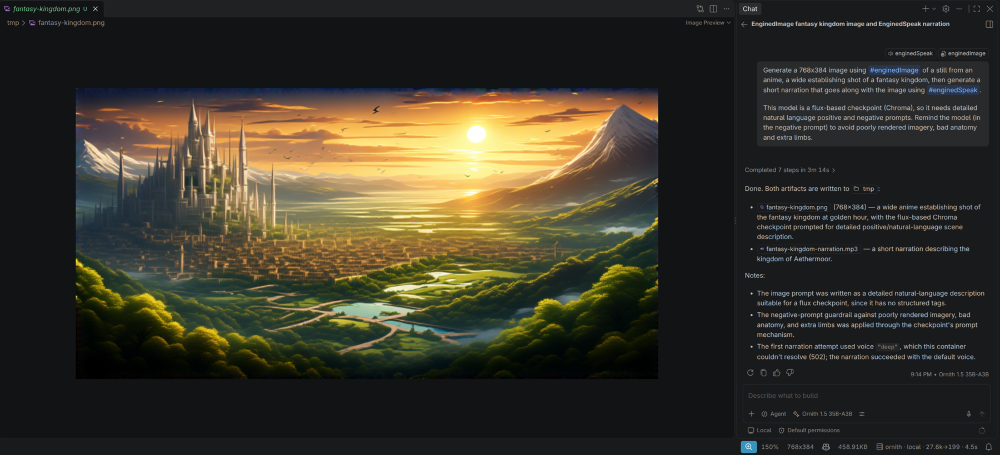
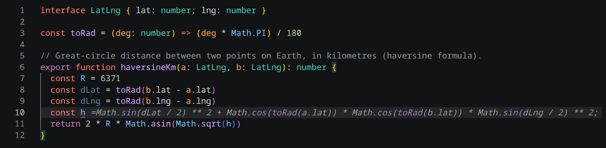
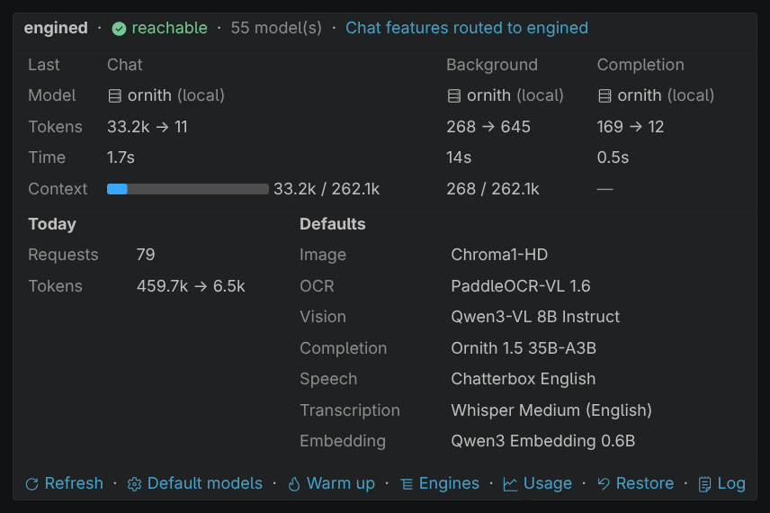
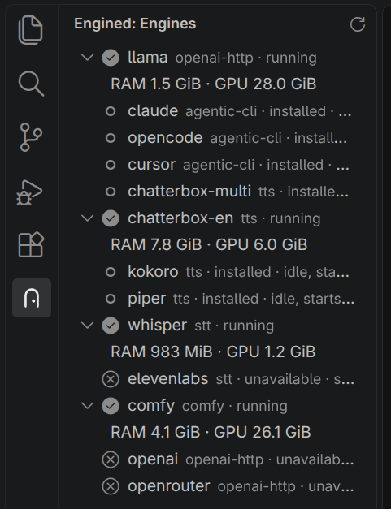
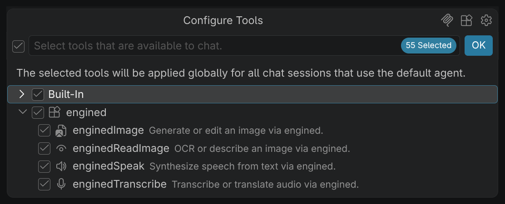
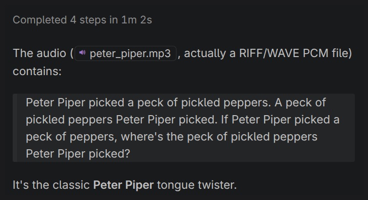
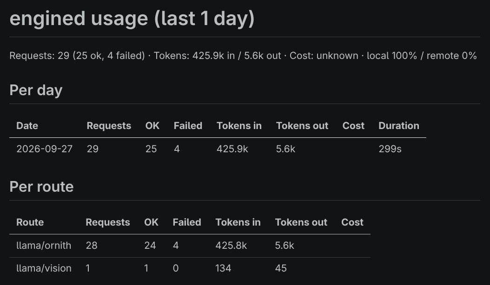
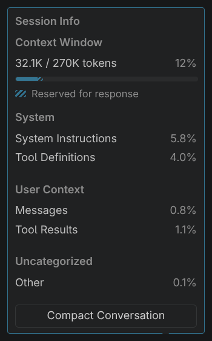

<h1 align="center">engined for VS Code</h1>

<div align="center">

[](LICENSE)
[](https://code.visualstudio.com/)

</div>

---

Brings [engined](https://github.com/Rethunk-Tech/engined) into VS Code's own Copilot Chat surface: engined's local models sit in the model picker beside Copilot's, its image/vision/audio/search routes attach as ordinary chat tools, and its completions route offers inline ghost text. Everything routes to engined running on the same machine, or reached over VS Code Remote-SSH.

The extension only ever talks to `engined.doors`; no request goes anywhere else, and the status bar always shows which route answered and whether it stayed local.

<p align="center"></p>

## Quick start

```bash
systemctl --user start engined && curl http://127.0.0.1:29200/openai/v1/models
```

Then open Copilot Chat's model picker and choose an `engined` model. Full runbook (building from source, attaching a tool, verifying, uninstalling): [HUMANS.md](HUMANS.md#quick-start).

## Features

- Local chat models in Copilot's model picker, streamed through engined
- Five agent tools: generate/edit images, OCR or describe an image, transcribe or translate audio, synthesize speech, semantic workspace search
- Inline completions (ghost text), optionally with neighbouring-file context
- Status bar shows what answered, whether it ran locally, tokens used, and a loading state
- An Engines view for warming, holding, and stopping engines, with live resource usage
- A usage report (per-day/per-route requests, tokens, cost, and local/remote split) across every configured door
- Image attachments work on a text-only engined model that engined bridges to a vision route
- Copilot's Context Window meter shows the token usage engined reports for each reply

## Screenshots

<table>
<tr><td align="center" colspan="2"><br><sub>Fill-in-the-middle completions from a local model</sub></td></tr>
<tr><td align="center"><br><sub>Status popup: what answered, where, and at what cost</sub></td><td align="center"><br><sub>Engines view with live resource use</sub></td></tr>
<tr><td align="center"><br><sub>engined's tools in Copilot's tool picker</sub></td><td align="center"><br><sub>Speech-to-text through #enginedTranscribe</sub></td></tr>
<tr><td align="center"><br><sub>Usage report across routes</sub></td><td align="center"><br><sub>Copilot's Context Window meter with engined's counts</sub></td></tr>
</table>

## Documentation

| Doc | Covers |
| --- | --- |
| [HUMANS.md](HUMANS.md) | Build, run, use, and configure the extension |
| [AGENTS.md](AGENTS.md) | Contributor map and invariants |
| [CONTRIBUTING.md](CONTRIBUTING.md) | Commit conventions and test steps |
| [SECURITY.md](SECURITY.md) | Vulnerability disclosure |
| [CHANGELOG.md](CHANGELOG.md) | Release notes |
| [docs/tools.md](docs/tools.md) | Agent tool parameters |
| [docs/polling.md](docs/polling.md) | Model-list polling internals |
| [docs/reasoning-effort.md](docs/reasoning-effort.md) | Reasoning-effort mapping |
| [docs/settings.md](docs/settings.md) | Every `engined.*` setting |

## License

[MIT](LICENSE)
